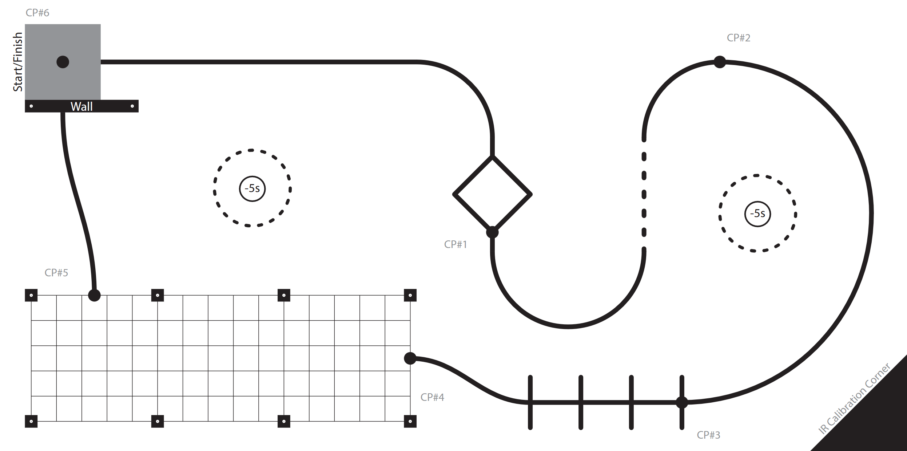
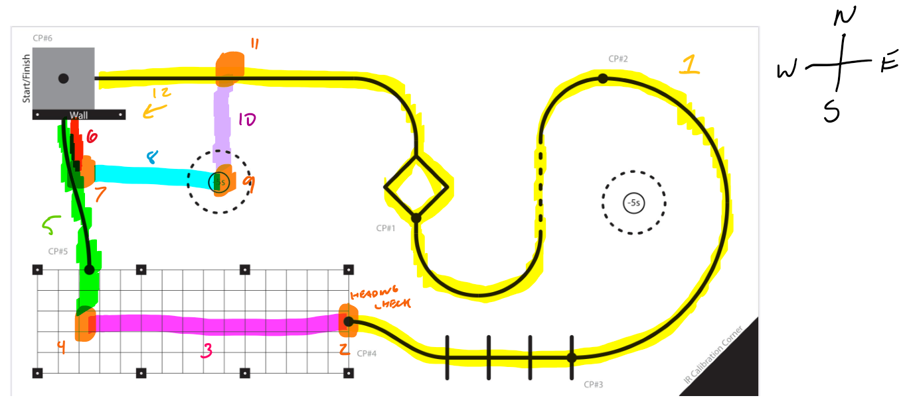
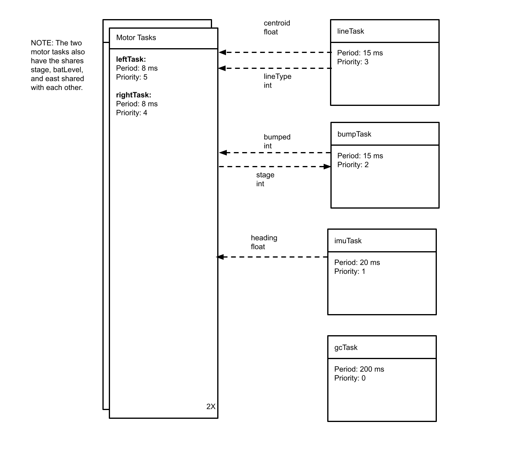
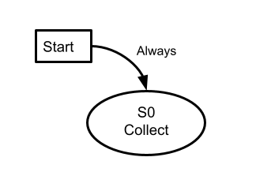
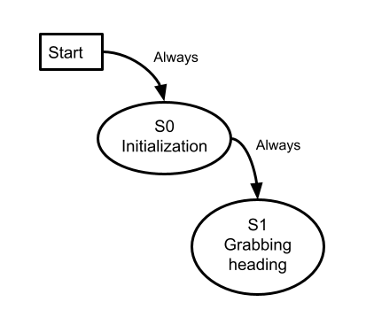
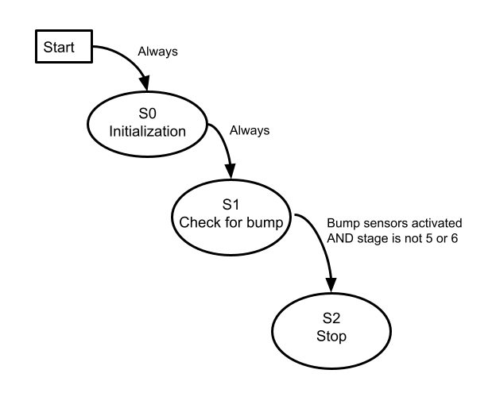
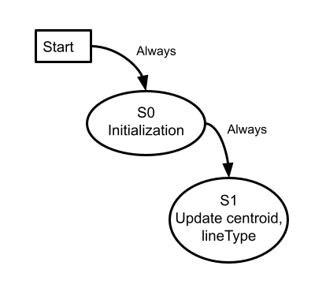
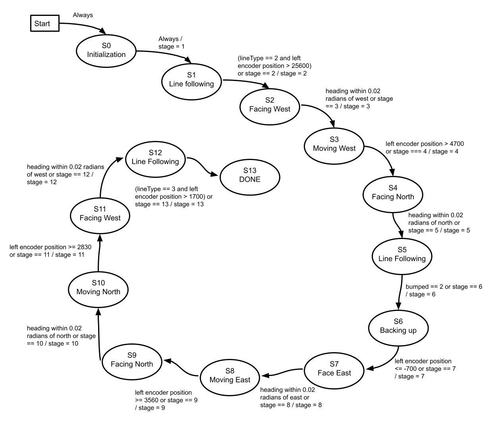

# ME-405-ROMI

# Table of Contents

[Overview](#Overview)

[Videos](#videos)

[Tasks](#Tasks)
- [gcTask](#gcTask)
- [imuTask](#imuTask)
- [bumpTask](#bumpTask)
- [leftTask](#leftTask)
- [lineTask](#lineTask)
- [rightTask](#rightTask)

[Classes](#Classes)
- [BumpSensor](#BumpSensor)
- [Encoder](#Encoder)
- [IMU](#IMU)
- [LineSensor](#LineSensor)
- [Motor](#Motor)

# Overview

Below is the course Romi had to complete for this project.

To complete this course, we decided to break it up into sections based on the main activity performed in each section. We referred to these sections as "stages," since they don't line up with the checkpoints on the track. The stage numbers also directly correspond to the state numbers in leftTask and rightTask. We also referred to the top of the course as "north," the right as "east," left as "west," and down as "south," creating local cardinal directions for the course. This terminology will be used in this description for consistency. 

The below image is from our planning, and as such is messy, but it does show our thought process for this approach. It also shows the local cardinal directions of the course.

In order, the stages are:
1. Line follow until the start of the grid, controlling using the centroid of the line
2. Turn so Romi is facing west
3. Head west, controlling using the IMU heading
4. Turn north
5. Follow the line until the bump sensors are activated
6. Back up facing north
7. Turn east
8. Head east
9. Turn north
10. Head north
11. Turn west
12. Head west until the line sensor reads all black

Some of these stages duplicate the same activity, such as stages 2 and 11 both being tasks that turn Romi west, or stages 2, 4, 7, 9, and 11 all being strictly turn in place stages (shown in orange in the image above). However, due to time constraints, and in an effort to work sequentially through the course, we continued with this approach. We wanted to be able to dial in each stage as they came along, and didn't want to risk any tweaks that made a later stage work messing up an earlier stage that was already working properly. 

In each stage where Romi is not just turning in place, we implemented a PI controller. Each of these controllers were tuned to the task Romi would complete during that stage, so we reused the line following constants for each line following task, and the heading constants for the heading following tasks.

# Videos

These are the videos for the two completed runs our Romi had during the final test day.

[Run 1](https://youtu.be/CR8xlK-HHFw)

[Run 2](https://youtu.be/JZjPs5Mh1RU)

# Tasks

These are the tasks run by the scheduler in the main file. Each gets passed a tuple of shares by the scheduler when run. These shares are:
- **batLevel:** The current voltage of the battery. Shared between leftTask and rightTask.
- **bumped:** Shares whether or not the bump sensors have been pressed. Shared between bumpTask, leftTask, and rightTask
- **centroid:** The most recently updated centroid reading from the line sensor. Shared between lineTask, leftTask, and rightTask
- **east:** The initial IMU heading reading when main is run. Shared between imuTask, leftTask, and rightTask.
- **heading:** The most recently updated IMU heading reading. Shared between imuTask, leftTask, and rightTask.
- **lineType:** The most recently updated type of line the line sensor read. Shared between lineTask, leftTask, and rightTask
- **stage:** The current stage of the course. This allows the left and right tasks to be in the same stage and not get out of sync. Shared between leftTask, rightTask and bumpTask.

The tasks here are indexed by their file name rather than class name for ease of understanding which task does what. The class name is included in the task description. Each task also has a finite state diagram in its description.

The task diagram is shown below.

## [gcTask](https://github.com/Miguel11722/ME-405-ROMI/blob/main/finalProject/gcTask)

**Finite State Diagram:**

**Description:** This task runs the garbage collector.

Period: 200 ms
Priority: 0

**Class Name:** collector

## [imuTask](https://github.com/Miguel11722/ME-405-ROMI/blob/main/finalProject/imuTask)

**Finite State Diagram:**

**Description:** This task reads the current heading from the IMU and puts it in the heading share.

Period: 20 ms
Priority: 1

**Class Name:** BNO

## [bumpTask](https://github.com/Miguel11722/ME-405-ROMI/blob/main/finalProject/bumpTask)

**Finite State Diagram:**

**Description:** This task updates the bumped share based on whether or not the bump sensors have been bumped. If the stage share is not 5 or 6, this calls for an emergency stop when the bump sensors are hit.

Period: 15 ms
Priority: 2

**Class Name:** Bump

## [leftTask](https://github.com/Miguel11722/ME-405-ROMI/blob/main/finalProject/leftTask)

**Finite State Diagram:**

**Description:** This task controls Romi's left motor. It controls Romi based on the stage of the track, and shares the current stage with rightTask. It also receives stage information from rightTask- if one of them changes state, both of them do. 

Period: 8 ms
Priority: 5

**Class Name:** leftMotor

## [lineTask](https://github.com/Miguel11722/ME-405-ROMI/blob/main/finalProject/lineTask)

**Finite State Diagram:**

**Description:** This task updates the line sensor and puts the new centroid in the centroid share, and the new line type in the lineType share.

Period: 15 ms
Priority: 3

**Class Name:** lineSensor

## [rightTask](https://github.com/Miguel11722/ME-405-ROMI/blob/main/finalProject/rightTask)

**Finite State Diagram:**

**Description:** This task controls Romi's right motor. It controls Romi based on the stage of the track, and shares the current stage with leftTask. It also receives stage information from leftTask- if one of them changes state, both of them do. 

Period: 8 ms
Priority: 4

**Class Name:** rightMotor

# Classes

Each class is described below, with links to the corresponding file. The classes are indexed by class name, with the file name included in the task description.

## [BumpSensor](https://github.com/Miguel11722/ME-405-ROMI/blob/main/finalProject/bumpsensor)

**Description:** A driver for the bump sensors on a Pololu Romi robot.

**File Name:** bumpTask.py

## [Encoder](https://github.com/Miguel11722/ME-405-ROMI/blob/main/finalProject/encoder)

**Description:** A driver for the encoders on a Pololu Romi robot.

**File Name:** encoder.py

## [IMU](https://github.com/Miguel11722/ME-405-ROMI/blob/main/finalProject/BNO055)

**Description:** A driver for an Adafruit BNO055 IMU.

**File Name:** BNO055.py

## [LineSensor](https://github.com/Miguel11722/ME-405-ROMI/blob/main/finalProject/analoglinesensor)

**Description:** A driver for a 7 channel analog line sensor array from Pololu.

**File name:** analoglinesensor

## [Motor](https://github.com/Miguel11722/ME-405-ROMI/blob/main/finalProject/motor)

**Description:** A driver for the motors on a Pololu Romi robot.

**File Name:** motor.py
